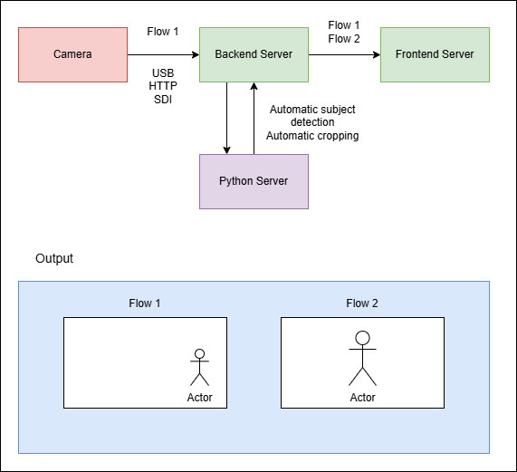

## Camera Auto-tracking Webapp

- Data Ingestion:
    - Use FFmpeg to get camera flow from Camera via USB or HTTP into python server

- Subject detection and cropping of person:
    - YOLO and OpenCV respectively for automatically detecting subject and cropping the image
    - Techniques used to reduce latency:
        - Send cropping metadata to frontend server
        - Use GPU / CUDA to optimize models
        - Use parrallel processing and performance enhanced technologies
        - Running detection every N frmaes

- Frontend, Backend:
    - Backend server deployed with FastAPI and data is sent to the web app frontend using aiortc (python implementation of WebRTC)
    - Frontend uses React + Tailwind CSS

- Technical considerations
    - Low latency
    - Keep image quality as much possible
    - Security

High level diagram: 

